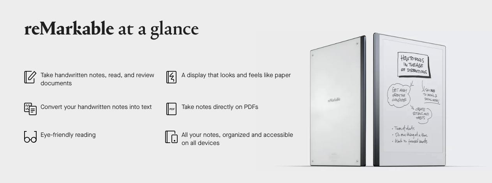
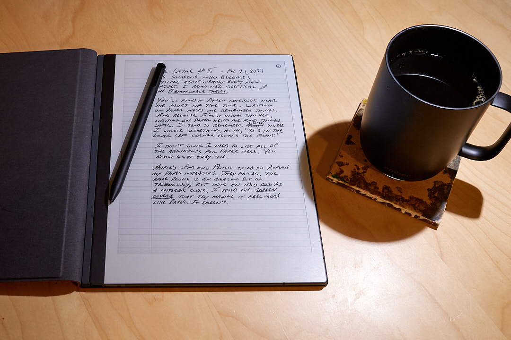

You'll find a paper notebook near me most of the time. Writing on paper helps me remember things better than typing notes into an app on a computer. Because I'm a visual thinker, writing on paper helps me find things later. I tend to remember, spacially, where I write things; as in, "It's in the lower left corner toward the front." 

I thought Apple's iPad and Pencil would be ideal for taking notes. They aren't. The combination of iPad and Pencil is an amazing bit of technology, but using an iPad as a notebook sucks. Writing on an iPad feels like using a somewhat clumsy input device through glass onto a computer. I tried the screen covers that are supposed to make writing on an iPad feel more like paper. They don’t. And worse, the rest of the iPad's features (along with the entire internet) are always right there, lurking behind the glass, waiting to distract me.

The [Remarkable tablet](https://remarkable.com/) is billed as "the only tablet that feels like paper," so I was of course intrigued. Skeptical, but curious. I wondered if it could really replace my paper notebooks even after the iPad failed.

Turns out that, yes, it can.

I love the Remarkable tablet, and here's why.

**It really does feel a lot like paper**. The first time I wrote on it I was like, "Woah, that's nice!" It's enough like paper that I'm not distracted by how it feels.

**I love the hardware**. The device looks and feels great. Solid. It's as thin as a half-used legal pad.  The pen is light but not too light. And speaking of the pen, I bought the fancy one with an "eraser". The eraser takes a minute to get used to, but is exactly the right thing. The pen doesn't use a battery, so there's never that fear of not being able to write because I forgot to charge it.

**I love the look of the screen.** It looks like paper. There's no backlight, which many consider a missing feature. I don't. It's very easy on the eyes. It's cool that I can choose the type of "paper". No more fretting about which type of notebook to buy. Should I choose lined paper or do I go with a dot grid pattern? Doesn't matter, now I can have all of them any time I want.

**Battery life is great**. The battery lasts long enough so that I'm not always thinking about the battery. I charged mine a couple days ago and it's now at 87%. 

**It's always ready.** Using an iPad for writing is acceptable if I'm specifically sitting down to write for a while, but it's less useful for general note taking. The Remarkable is always ready. I have mine set to sleep after 20 minutes. If it does happen to fall asleep while I'm thinking or doing something else, I just tap the button at the top left and it's ready to go in less than a second. The iPad, on the other hand, needs to sleep much sooner if I want the battery to last through a couple of meetings. And when the iPad does fall asleep (as it always does) I have to tap to wake, then swipe up, then lean over so FaceID works (and it often doesn't, so then I must also enter my pass code). This makes the iPad an unacceptable replacement for paper. The always-ready feeling of the Remarkable might be the most meaningful difference between it and the iPad. It's not as ready as paper, but it's close.

**I love the lack of features.** What I love most about the Remarkable tablet is what it _doesn't_ do, which is just about everything. There's nothing else there[^nothing]. I can write and organize notes and sketches. That's it. There's nothing lurking behind a swipe or a notification. If I want, I can see all my notes on the companion apps on my Mac and iOS devices. I can convert my handwriting to text and email it to myself. That's how I wrote this post, in fact. It worked great.

Many of the reviews I've read have focused on all the features that the Remarkable 2 doesn't have. They miss the fact that those missing features are the greatest _feature_ of the Remarkable. The Remarkable tablet is not much more than a stack of flexible notebooks, and that's all I wanted.

[^nothing]: Well, I can read and write on PDFs but that is likely something I will only occasionally do.